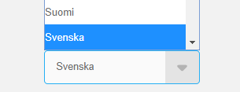
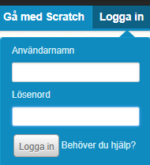
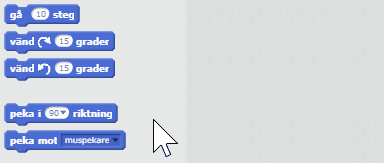
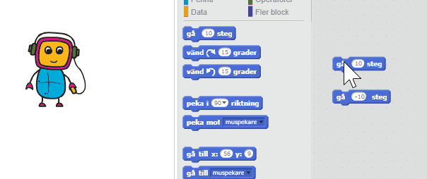
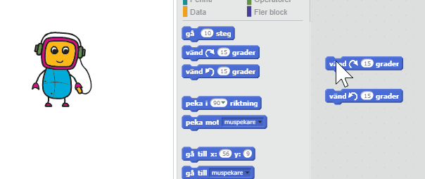
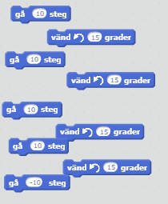
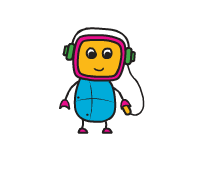
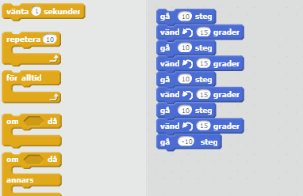
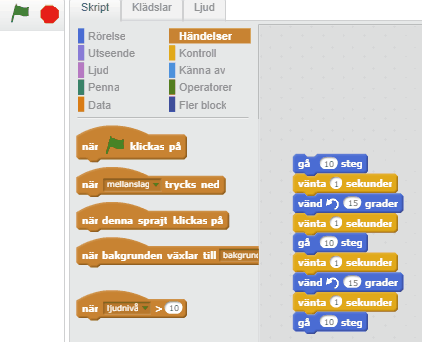

# Startövning 1: Rörelse

Nu ska du få lära dig grunderna i hur man får figurer att röra sig i Scratch.

De flesta program och spel du kommer göra i Scratch kommer innehålla någon form av figur. I scratch kallar vi dessa för sprajtar. Dessa sprajtar brukar ofta röra sig, tänk till exempel hur Super Mario eller Pacman rör sig.

I vårt fall ska vi få en av kodcentrum-robotarna att röra sig så här:

## 1: Remixa 

När man ska koda i Scratch kan man antingen starta ett eget program själv, eller jobba vidare på någon annans program. Detta kallas för att remixa. Vi ska nu testa att remixa ett program från kodboken.

1. Klicka på länken nedanför för att komma till det förberedda programmet.

[Programlänk](https://scratch.mit.edu/projects/210051047/)

2. Om texten på hemsidan är på Engelska så kan du ändra språk längst ner på sidan.

3. Se till att du är inloggad på ditt konto.

4. Klicka på Se inuti.

5. Klicka på remixknappen för att spara en egen kopia av programmet

Vi kan nu koda som vi vill i det remixade projektet. I just detta finns ingen kod än, bara en robotsprajt. Vi ska nu lära oss hur vi kan lägga in kod för att få roboten att röra sig.

## 2: Gå-skriptet

1. Se till att robotsprajten är markerad och dra ut ett **"gå 10 steg"**-skript ifrån rubriken **Rörelse** till skriptytan.

2. Testa att dubbelklicka på en blå del av skriptet. Vad händer?

	Roboten rör sig en liten bit till höger varje gång vi dubbelklickar. Testa nu att klicka på siffran 10 i skriptet och ändra till en högre siffra. Vad händer då?

	Om roboten skulle hamna för långt till höger kan du bara dra in henne till mitten igen.

3. Testa sätta ett minustecken framför siffran. Vad händer då? 

Snyggt jobbat! Vi kan nu få roboten att gå fram och tillbaka bara genom att dubbelklicka på våra Gå-skript.

## 3: Vänd-skriptet

Förutom att gå fram och tillbaka så vill vi att roboten ska kunna vända på sig. För att göra det har vi två olika skript, **"vänd höger 15 grader"** och **"vänd vänster 15 grader"** under rubriken **Rörelse**.

1. Dra ut båda två och dubbelklicka på dem. Vad händer om du byter siffran 15 till något större? Testa med 30, 90, 180 och 270.

2. Testa byta till 360. Vad händer då? 

3. Testa byta till något ännu större än 360 och till något negativt. Vad händer då?

Nu när vi har Vänd-skripten kan vi få roboten att vända sig om.

## 4: Vänta-skriptet

Nu har vi lärt oss hur vi får roboten att göra enskilda rörelser, men hur ska vi göra för att få henne att göra flera saker i rad?

Scratch-skripten funkar lite som legobitar, man kan sätta ihop dem på olika sätt. 

1. Sätt ihop några av skripten du tagit fram efter varandra.

2. Dubbelklicka på det första skriptet.

3. Roboten gör allt vi sa åt henne, men det går så snabbt att vi inte hinner se alla steg. Vi kan lägga till ett **"vänta 1 sekunder"** ifrån rubriken **Kontroll** mellan varje Gå-skript och Vänd-skript. Nu kan vi följa varje steg hon gör.

## 5: Start-skriptet

Nu har vi lärt oss hur man får roboten att röra sig genom att dubbelklicka direkt på blocken. För att slippa dubbelklicka på blocken, och få programmet att starta behöver vi en startknapp. För detta använder vi skriptet **"när Grön flagga klickas på"** under rubriken **Händelser**.

1. Dra in Flagg-skriptet ovanför rörelse-skripten som du skapade och testa klicka på den gröna flaggan ovanför roboten.

Det finns många olika sorters händelse-skript man kan använda. 

Alla skript i programmet måste vara kopplade till ett händelse-skript, annars kommer inte programmet veta när den ska köra skripten.

Bra jobbat! Nu har du lärt dig grunderna i hur man får saker att röra sig i Scratch. Nu är du redo att testa på lite mer avancerade saker.
