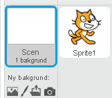
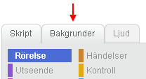
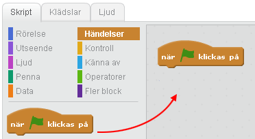
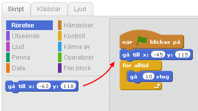
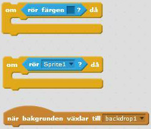
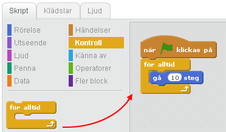
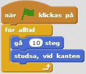
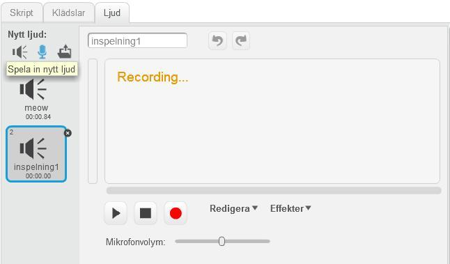
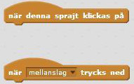

# Egen berättelse

Nu ska du få skapa en egen berättelse i Scratch. En berättelse innehåller ofta en huvudkaraktär som ska nå ett mål men som möter något hinder på vägen, ett problem som behöver lösas.

Exempel: _En spindel är på väg till sitt hus uppe i spindelnätet. Då börjar det regna, en regndroppe träffar spindeln som faller ner i en vattenpöl. Spindeln försöker klättra upp igen men kommer inte ur vattenpölen som blir allt djupare. – Hjälp! ropar spindeln som inte kan simma. Då kommer solen och jagar bort regnmolnet. Solen torkar bort vattnet och spindeln kan klättra upp till sitt hus._ Känner du igen berättelsen?

## 1: Planera din berättelse

Det är en god idé att först tänka igenom vad berättelsen ska handla om. Du kan rita upp det som ska hända på ett papper, det kallas för att göra ett STORYBOARD. Det behöver inte vara snyggt utan bara så att det går att förstå, streckgubbar fungerar bra!

Samtidigt som du ritar upp berättelsen steg för steg, behöver du fundera på vilka skript du kommer att behöva för att ANIMERA din berättelse i Scratch.  Att _animera_ betyder att _levandegöra_, t ex att göra så att karaktärerna rör sig och låter.

1. Rita upp din berättelse. Håll det enkelt! Tänk på det här:

  * VEM ska berättelsen handla om?

  * VAR ska berättelsen utspela sig?  

  * Vilket MÅL ska huvudkaraktären nå?

  * VAD ska hända som innebär ett hinder på vägen?

  * HUR ska det lösas?

2. Testa din storyboard på någon. Förstår hen berättelsen? Går den att animera i Scratch?

## 2: VEM? Välja huvudkaraktär

Börja med att ta bort katten och välja en ny sprajt till din berättelse. Du behöver en huvudkaraktär, men kanske också några fler karaktärer som ska vara med?

2. Tryck på saxen (högt uppe i mitten) och sedan på katten så försvinner den.

  

3. Gå till biblioteket för att välja en ny sprajt, tryck på knappen för "Välj sprajt från bibliotek". Om du hellre vill rita en egen huvudkaraktär, välj "Rita ny sprajt" (penseln).

  

4. Om du behöver ändra storlek på sprajten, tryck på knappen med pilar inåt eller utåt och sedan på sprajten tills den är lagom stor.

  

## 3: VAR – välja bakgrund

Nu ska du välja bakgrund för din berättelse, en eller flera olika ifall du vill kunna byta scen i berättelsen. Du kan använda färdiga bakgrunder från biblioteket, eller rita själv.  

5. För att ändra bakgrund trycker du först på SCEN längst till vänster.  Nedanför kan du trycka på "Välj bakgrund från bibliotek". Vill du rita själv går du in på fliken BAKGRUNDER högst upp i mitten.

  	

**Tips:** Ska du rita flera bakgrunder trycker du på "Rita ny bakgrund" för att skapa en ny rityta. Du kan även kopiera din första bakgrund om du vill använda samma miljö men t ex rita till ett hus som sprajten ska komma fram till.

## 4: Animera berättelsen med skript

Nu när du har sprajt och bakgrund färdig kan du börja skapa ditt första skript. Det är skripten som ska ANIMERA din berättelse, få saker att hända i den.

Eftersom det är din berättelse behöver du själv prova dig fram och hitta de skript du behöver. Titta gärna på dina tidigare projekt och hur du gjorde skripten då. Här får du några tips på användbara skript för att skapa en berättelse.

> Gör **ett skript i taget och testa** ofta, tryck på START-knappen och se om skriptet gör det som du hade tänkt. Kom ihåg att **spara** ofta!

* **Vad ska hända när berättelsen startar?**

Använd blocket **"när START (flaggan) klickas på"** från **HÄNDELSER**.

Kom ihåg att sätta en startposition för din sprajt. Placera sprajten där du vill att den ska starta och välj **"gå till x: y:"** från **RÖRELSE**, koppla fast direkt under START-flaggan. De värden som står för X och Y är koordinater för sprajtens startposition.  

**Tips:** En enkel berättelse kan vara ett enda långt skript med block som följer varandra från START. Men för längre berättelser kan du behöva använda andra **HÄNDELSER** eller block från **KONTROLL**, t ex att något sker **när** bakgrunden ändras, **om** sprajten **rör** en viss färg eller vid en annan sprajt.

* **Hur ska sprajten röra sig?**

  Använd block från **RÖRELSE**. Om sprajten ska gå en liten bit kan det räcka med att sätta antalet steg. **Om sprajten ska röra sig under hela berättelsen**, eller **upprepa ett mönster av olika rörelse**r, kan du behöva en LOOP från **KONTROLL**.  Du bestämmer om den ska vara **"för alltid"** eller bara repetera ett visst antal gånger.

  

  Om din sprajt försvinner utanför scenen när den rör sig kan du behöva använda **"studsa, vid kanten"** från **RÖRELSE**. Då vänder sprajten och rör sig tillbaka när den kommer till kanten.

  

* **Ska sprajten säga något?**

  Använd blocket **"säg ___ i 2 sekunder"** från **UTSEENDE**. Välj vad sprajten ska säga och hur länge pratbubblan ska synas. Bestäm **när** eller **om < > då** pratbubblan ska visas.

  

* **Ska sprajten byta klädsel? **

  Om du väljer att göra flera klädslar till din sprajt, kan du växla mellan dem med **"byt klädsel till ()"** från **UTSEENDE**. T ex om din karaktär tappar en sko som Askungen, blir prickig som Den vilda bebin, eller byter klänning som Elsa i Frost. Bestäm **när** eller **om < > då** klädseln ska bytas ut. Det går även att ändra **färgeffekt** på klädseln.

  

* **Ska scenen byta bakgrund?**

  Om berättelsen ska utspela sig i flera olika miljöer, kan du byta bakgrund på scenen. Använd blocket **"byt bakgrund till ()"** från **UTSEENDE**. Bestäm **när** eller **om < > då** bakgrunden ska bytas ut.

  

  **Tips:** Om sprajten ska röra sig från en bakgrund till en annan, t ex från en skog in i en stad, tänk på att flytta sprajten samtidigt som du byter bakgrund, så att det ser ut som att sprajten går ut ur bild till höger och sedan kommer in i bild på vänster sida!

* **Ska en ny sprajt dyka upp senare i berättelsen? Eller försvinna?**

  Använd blocken **"visa"** och **"göm"** från **UTSEENDE** och bestäm **när** eller **om < > då** det ska hända. Glöm inte att ställa in startposition för den nya sprajten, både koordinaterna och om den ska visas eller vara gömd från början.

  

* **Vill du använda ljud i berättelsen?**

  Använd blocket **spela ljudet** från **LJUD** och bestäm **när** eller **om < > då** det ska hända. Välj ljud från biblioteket. Om det finns mikrofon i din dator kan du själv spela in röster till dina karaktärer, eller skriva ned berättelsen och läsa den som en saga.  

  

* **Vill du att det ska gå att styra berättelsen?**

  En INTERAKTIV berättelse betyder att den som tittar också kan vara med och påverka handlingen. Kanske vill du att det ska gå att styra något i berättelsen för att hjälpa huvudkaraktären? T ex med att plocka bort något hinder i vägen eller få undan ett skrämmande spöke?  

  Välj från **HÄNDELSER** om du t ex ska klicka på sprajten eller använda tangentbordet för att styra. Bestäm vad som ska hända **när** eller **om < > då** du styr berättelsen, och vad som ska hända om du inte gör något.

  

## Färdig!
Grattis, nu har du gjort klart uppgiften.

**Glöm inte att spara ditt projekt!** Döp det gärna till uppgiftens namn så att du enkelt kan hitta den igen.

> **Testa ditt projekt**  
Visa gärna någon det som du har gjort och låt dem testa. Tryck på DELA för att andra ska kunna hitta spelet på Scratch. Gå ut till projektsidan och låt någon annan testa spelet!

## Frågeställningar

* Vad är ett storyboard?

* Vilka delar bör ingå i en storyboard?

* Varför är det en bra idé att använda sig av en storyboard när du vill skapa en berättelse?

* Vad betyder det att animera något?

* Vad finns det för alternativ att styra en berättelse med?
