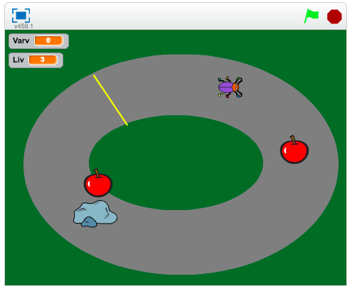
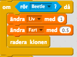
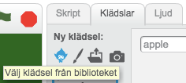
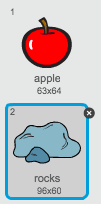
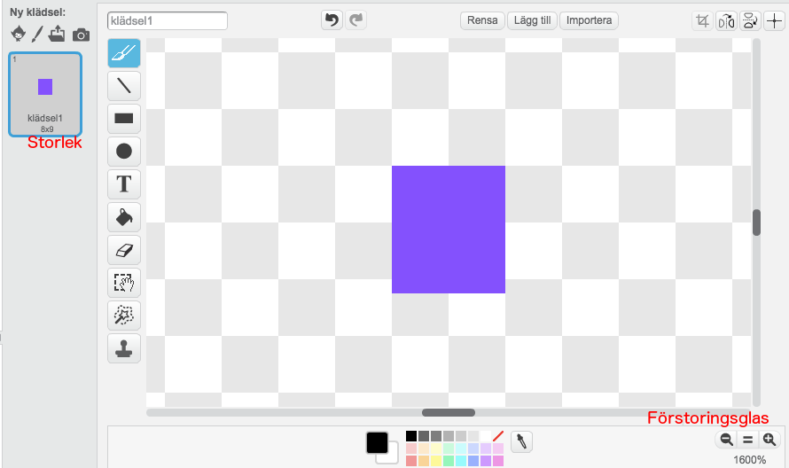
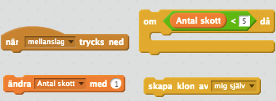
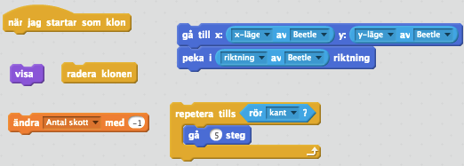
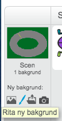
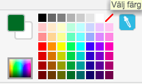
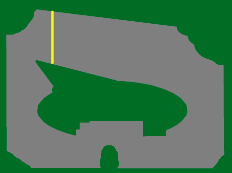

# Bug race deluxe - del 2

Detta är fortsättning på uppgifterna **Bug race** och **Bug race deluxe – del 1**. Du måste ha gjort båda dessa för att kunna göra denna övning. I del 2 kommer du få koda så att skalbaggen kan åka olika fort du kommer lägga in hinder för den och du kommer skapa flera banor. 

Ett exempel på hur det kan se ut hittar du [här:](https://scratch.mit.edu/projects/197016490)

## 1 – Fart

Vi vill att farten ska ändras när skalbaggen äter mat så att det blir svårare ju fler liv du får.

1. Skapa en variabel som heter **Fart**

2. Visa inte variabeln på spelplanen genom att klicka bort krysset under kategorin **Data**

    

3. Ändra på koden för sprajten **Skalbaggen**

    1. Sätt **Fart** till 2 när meddelandet **"starta"** tas emot. *Du kan ändra på skriptet du redan har kodat.*

    

    2. Ändra i "**För alltid**"-loopen så att skalbaggen går “**Fart”** steg i stället för det antalet steg den går nu

    

4. Ändra på koden för sprajten som är **Mat**

5. Ändra** Fart** med 0.5 eller 1 när **sprajten** rör **skalbaggen**

    

> Testa! Går det för fort eller för långsamt? I så fall kan du ändra hur mycket **Fart** är i början av spelet och hur mycket det ändras när skalbaggen äter mat.

## 2 – Hinder

Nu ska du göra det ännu svårare för Skalbaggen genom att koda hinder som dyker upp på banan. Mycket att koden kommer vara samma som för sprajten som är **mat** – därför kommer du börja med att kopiera denna sprajt.

1. Kopiera sprajten som är **mat**, t.ex. äpplet

    

2. Markera den nya sprajten och klicka på i:et i övre-vänstra hörnet 

3. Döp om sprajten till **Hinder**

    

4. Kryssa och i rutan **Visa** så du tillfälligt visar sprajten på spelplanen

5. Gå till fliken **Klädsel**

    1. Lägg till en ny klädsel från bibliotek

    

    2. Du kan till exempel välja en **sten**

    

6. Förminska sprajten om den är för stor  

Nu behöver du ändra koden så att den nya sprajten beter sig mer som ett hinder än mat.

1. Ändra koden som körs när sprajten **Hinder** rör vid sprajten **Skalbagge**

    1. Ändra **Liv** med **-1**

    2. **Skicka** meddelandet **"Game over?"** och **vänta**

    3. **Skicka** meddelandet **"starta"**

    4. **Radera** klonen

    

> Test! Kommer stenarna upp för ofta eller stannar de kvar för länge? Ändra på koden som placerar ut kloner och tar bort dem.

## 3 – Skott

För att skalbaggen ska ha en chans att klara sig runt banan ska du få koda skott som skalbaggen kan använda sig av för att skjuta bort stenarna.

1. Rita en ny sprajt

    1. Den ska vara ungefär 10x10 pixlar stor, använd förstoringsglaset

    2. Färglägg den med en trevlig färg. *Obs! Inte samma färger som du redan har på banan, gräset eller mållinjen.*

    

2. Skapa en ny variabel som heter **"Antal skott"**

3. Visa inte **"Antal skott"** på spelplanen

Nu behöver du skapa ett skript för skottet som gör att det:

* Avfyras när du trycker på mellanslag

* Försvinner när den rör kanten

* Bara kan avfyras 3 skott åt gången på scenen, för annars kan du fylla hela scenen med skott!

1. Skapa ett skript för sprajten **Skottet** som säger

    1. När **START** klickas på

    2. Göm

    3. Sätt **Antal skott** till 0

    

2. Skapa ett andra skript för sprajten **Skottet** som säger

    4. När **mellanslag trycks ned**

    5. OM **"Antal skott"** är **mindre än 5**

        1. Ändra **"Antal skott"** med 1

        2. **Skapa klon** av mig själv

    

Nu har du skript som gör att maximalt 4 skott avfyras när du trycker ner mellanslag. Nu ska du koda så att skottet visas och försvinner när den når till kanten.

1. Skapa ett nytt skript för **Skottet** som säger

    1. När jag startar som klon

    2. Gå till x: **x-läge av Skalbagge** y: **y-läge av Skalbagge**

    3. Peka i riktning av **Skalbagge**

    4. Visa

    5. **Repetera** tills **rör kanten:**

        1. **Gå 5** steg

    6. Ändra "**Antal skott" **med **-1**

    7. **Radera** klonen

    

2. Ändra koden för sprajten **Hinder** så att den försvinner om den rör sprajten **Skott**

    

## 4 – Flera banor

Nu finns det bara en bana som skalbaggen kan åka på, men det ska du ändra på nu!

1. Klicka på **Rita ny bakgrund**

    

2. Rita en ny bana

    1. Banorna ska ha samma färg på banan, t.ex. Grå

    2. Banorna ska ha samma färg på gräset, t.ex. Grönt

    3. Banorna ska börja på ungefär samma ställe

> Tips! För att få exakt samma färger på båda banorna kan du använda dig av verktyget **Välj färg**

> 

Den nya banan kan se ut till exempel så här:

1. Lägg ett block som byter bakgrund till den första när **START** klickas på

    

När ska skalbaggen komma till den nya banan? Ja, det är upp till dig. Här är två förslag:

**När du gjort några varv av en bana**

1. Ändra på OM-blocket som körs när skalbaggen nuddar mållinjen.

2. Lägg in dessa block precis innan du skickar meddelandet **"starta"**

    1. Skicka meddelandet **"Byt bakgrund"** OM **“Varv”** är lika med 3

    

3. Markera bakgrunden

4. Skapa detta skript för bakgrunden

    2. När jag **tar emot "Byt bana"**

    3. Nästa bakgrund

    4. Sätt **"Varv"** till **0**

    

**Varje gång du kommer i mål**

1. Ändra på OM-blocket som körs när skalbaggen nuddar mållinjen.

2. Lägg in ett block **skicka "byt bana"** innan du skickar meddelandet **“starta”**

    

3. Markera bakgrunden

4. Skapa detta skript för bakgrunden

    1. När jag **tar emot "Byt bana"**

    2. Nästa bakgrund

    

## Färdig!

Grattis, nu har du skapat ett nytt spel!

**Glöm inte att spara ditt projekt!** Döp det gärna till uppgiftens namn så att du enkelt kan hitta den igen.

> **Testa ditt projekt**

> Visa gärna någon det som du har gjort och låt dem testa. Tryck på DELA för att andra ska kunna hitta spelet på Scratch. Gå ut till projektsidan och låt någon annan testa spelet!

## Utmaningar

**Andra typer av hinder**

Hindren som du har kodat nu står till på banan och du kan ganska enkelt skjuta ner dem. Försök koda ett annat typ av hinder. Till exempel

1. Ett hinder som du behöver skjuta på flera gånger

2. Ett rörligt hinder som rör sig över banan

**Möjligt att köra på gräset**

Gör det möjligt för skalbaggen att åka på gräset. I stället för att starta om från början så kan till exempel hastigheten minska. Detta gör att det blir enklare att undvika svåra hinder.

**Andra typer av underlag**

Nu finns det två typer av underlag: bana och gräs. Rita och koda ett till underlag, till exempel grus. Vad som ska hända om skalbaggen kommer på detta underlag får du bestämma.

**Flera spelare**

Har du fortfarande bara en spelare? Koda en till sprajt som en kompis kan styra. Här är några tips:

1. Du måste ha en variabel **"Fart2"** för den andra spelaren

2. Du måste koda en sprajt **Skott** för den andra spelaren

3. Du måste se till att sprajten **Hinder** känner av skott från den andra spelaren

4. Du måste bestämma regler för när den nya banan ska visas

## Frågeställningar

* Vad är fördelen med att koda ett stort program i flera steg där varje steg är ett färdigt program?

* Vad är fördelen med att testa sin kod ofta?

* I uppgiften kopierade du sprajten **Mat** för att skapa sprajten **Hinder** *i stället för att koda en helt ny sprajt*. Vad är fördelar och nackdelar med detta?
