# Fantasisynth

Hur skulle du vilja spela musik? Förr i tiden fanns bara piano eller violer eller gitarrer som kunde spela klassisk musik. Idag finns datorer som kan spela nästan vilka otroliga ljud som helst som används som digitala instrument. 

Om du kunde spela musik på vad som helst, vad skulle du vilja spela på då? I vårt exempel har vi gjort en synth av äpplen, men ditt intrument kan se ut precis hur du vill! 

Ett exempel på projektet hittar du här:  
 <a href="https://scratch.mit.edu/projects/128504924/" target="_blank">  Exempel</a>
 
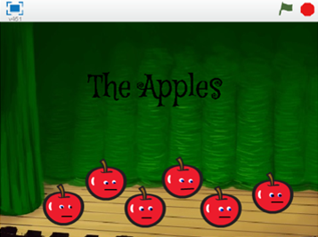

## Delmoment 1: Komma på en idé
Det första du behöver göra är att komma på hur ditt synth ska se ut! 

Du kommer att få göra en synth som du spelar med datorns tangenter. Bara din fantasi sätter gränserna hur din synth ska se ut, så länge det finns 6 sprajtar som kan vara tangenter. I det här exemplet använder vi äpplen som tangenter. 

1.	Ska det vara frukt som du spelar på? Ska det vara djur? Klura ut hur du vill att din synth ska se ut! 

2.	Har du fått en idé för din synth? Rita eller skriv ned dina idéer, berätta gärna för någon som kan komma med förslag. Tänk inte att någon idé är dum eller fel – i framtiden kan allt vara möjligt!

**Tips:** Är det ändå svårt att komma på en idé, **Välj sprajt från biblioteket** i Scratch och se om du kan hitta något där som kan bli tangenter till en synth!

  

## Delmoment 2: Välj bakgrund och sprajt

Först behöver du välja en bakgrund som passar som SCEN till din synth och en SPRAJT som passar som tangent. Vi kommer senare att kopiera sprajten för att göra flera tangenter.   

3.	För att ändra bakgrunden trycker du först på SCEN längst till vänster.

4.	Tryck sedan på knappen för LADDA UPP BAKGRUND FRÅN FIL. Välj vilken bakgrund du vill!

  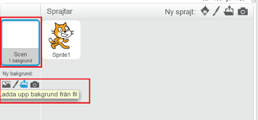

5.	Ta bort katten från scenen genom att trycka på saxen (högt uppe i mitten) och sedan på katten så att den försvinner.

  

6.	Nu ska du få välja en sprajt som ska vara din synthtangent. Tryck på knappen för NY SPRAJT. När du valt sprajt i biblioteket och klickat på OK så kommer sprajten att synas på scenen. I vårt exempel är sprajten ett äpple, men du kan välja precis vad du vill! 

  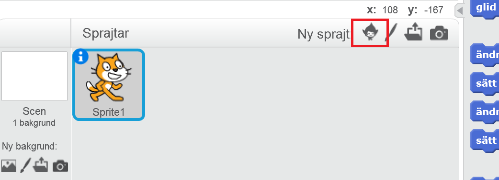  

  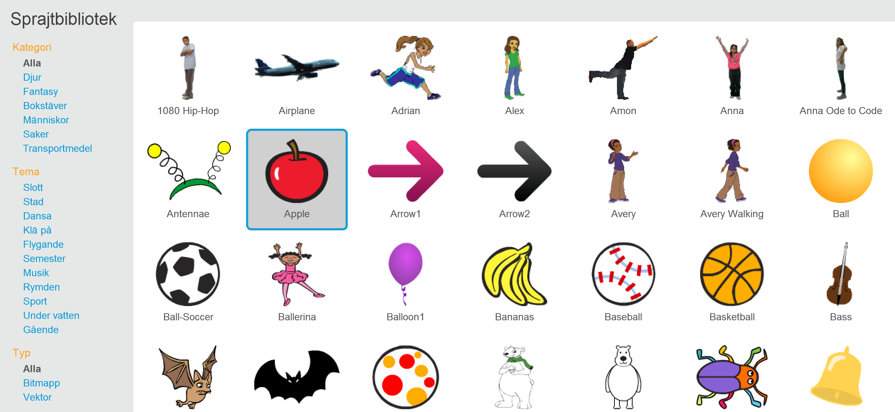

## Delmoment 3: Få äpplet att spela en ton

Nu ska du få göra så att sprajten spelar en ton när en tangent trycks ner på datorn. Men hur ska sprajten få reda på att den ska spela en ton? 

Svaret är MEDDELANDEN. När du trycker på tangentbordet ska tonen spelas, därför skickar skriptet ett meddelande till äpplet att spela en ton. Fiffigt va? 

7.	Klicka på SCEN så att den är markerad. Då får den en blå ring runt som sig.
 
8.	Under HÄNDELSER, hitta skript för **när mellanslag trycks ner**. Ändra mellanslag till **"a"** genom att klicka på lilla triangeln. Dra ut blocket till skriptområdet. 
	
  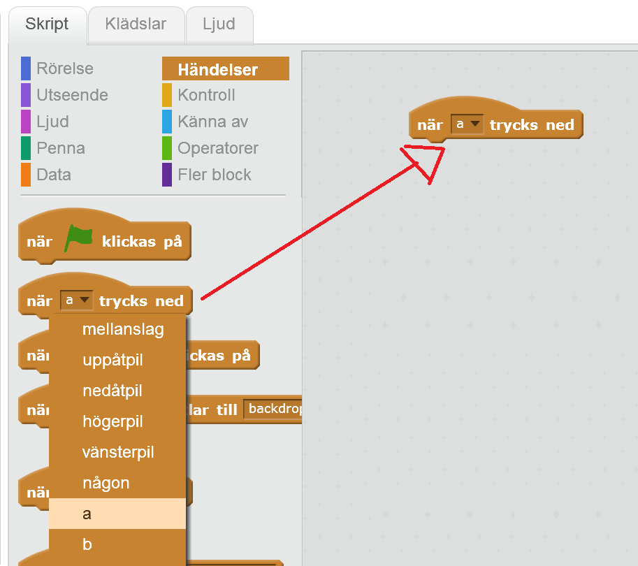

9.	Under HÄNDELSER, välj **skicka meddelande**. Ändra "meddelande1" genom att klicka på lilla triangeln i skriptet. Skriv istället **"spela äpple"** om det är ett äpple som du valt som sprajt. Annars kan du döpa den till vad du vill. Klicka OK. 

  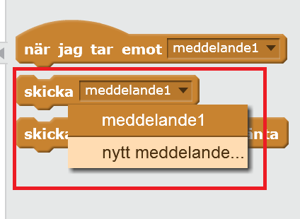

  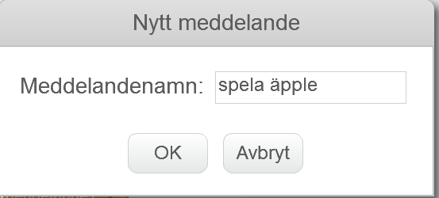

10.	Dra ut blocket till skriptområdet och koppla ihop skripten i rätt ordning i skriptområdet. 

11.	Nu ska vi göra ett skript för SPRAJTEN som tar emot meddelandet "spela äpple" och spelar en ton! Klicka på din sprajt så att den är markerad. Då får den en blå ring runt som sig. 

12.	Under HÄNDELSER, välj skript för **när jag tar emot meddelande**. Klicka på lilla triangeln för att hitta meddelandet **"spela äpple"**. Välj ditt meddelande och dra ut blocket till skriptområdet. 

  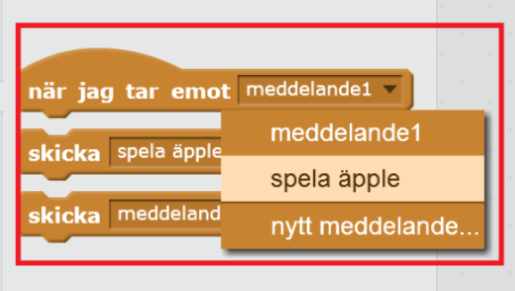

13.	Under LJUD, välj blocket för att **spela tonen 60 i 0,5 taktslag** och dra ut till skriptområdet, fäst under blocket som tar emot meddelandet.

  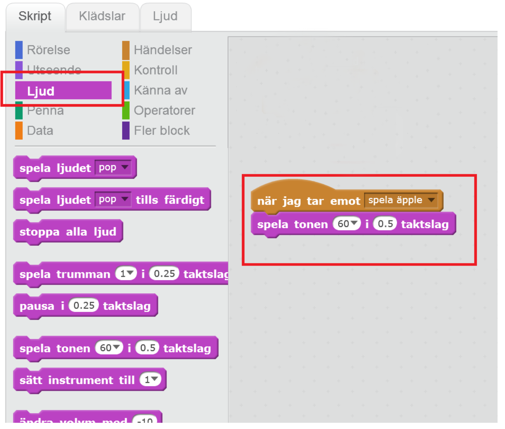

> Testa ditt projekt! Klicka på START. Vad händer när du trycker på tangenten A? Visst spelas det en ton? Om du inte hör en ton - öka volymen på din dator! 

## Delmoment 4: Få äpplet att sjunga!

Hur kan vi se att det är äpplet som spelar tonen när du spelar på tangentbordet? Vi vill ändra äpplets utseende så att det ser ut som att äpplet sjunger! För att göra det ska du ANIMERA sprajten, genom att byta mellan klädslar på den. 

14.	Gå till fliken KLÄDSLAR för sprajten. Börja med att rita två ögon på äpplet. Använd ritverktyget för **penna**, **cirkel** eller **linje** och rita två ögon på äpplet. Välj **färger** längst ner genom att klicka på dem i paletten. 

  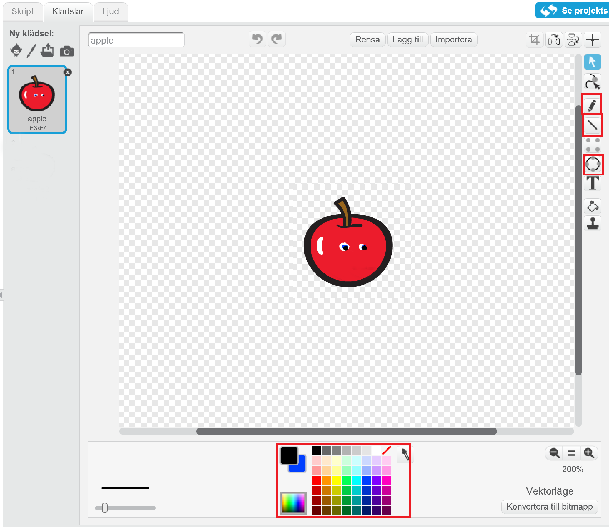

15.	Nu ska du kopiera klädseln så att det blir två klädslar med ögon. Klicka på **kopiering**-stämpeln högt uppe i mitten, och sedan på klädseln. Nu ska du ha två likadana klädslar.

  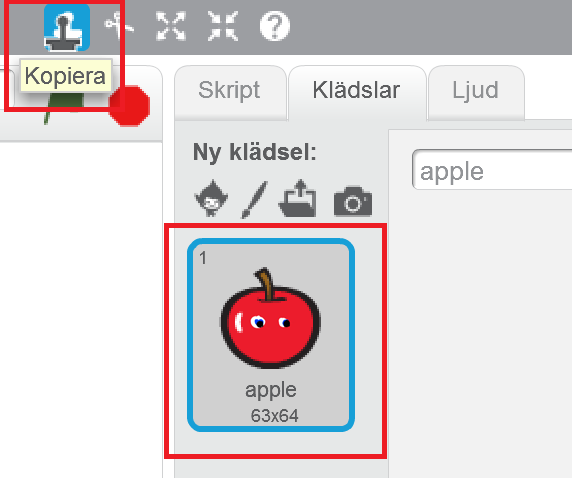

16.	Klicka på den första klädseln, "apple", och rita en stängd mun med **penna** eller **linje**-verktygen.

  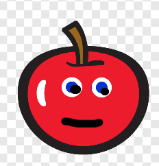

17.	Klicka på den andra klädseln "apple2".  Det här äpplet ska få en öppen mun så att det ser ut som att den sjunger! Välj en **cirkel** och välj om den ska vara **fylld** eller inte. Dra sedan ut cirkeln mitt i äpplet så att äpplet får en öppen mun. 

  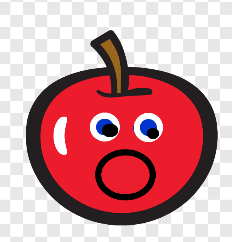

**Tips:** Har du valt en annan sprajt som redan har ögon och mun? Eller en sprajt med olika klädslar? I så fall får du redigera bilderna som du vill, så länge som en klädsel har stängd mun och en har öppen!

Nu ska vi göra ett skript som säger åt sprajten att ändra klädsel när ljudet spelas. Vi måste ju veta vilken sprajt det är som låter när tangenten trycks ned! Vi använder ett likadant skript som för att spela tonen. 

18. Dra ut ett block från HÄNDELSER: **när jag tar emot spela äpple**. Dra sedan ut ett block från UTSEENDE: **byt klädsel till...** och klicka på lilla triangeln och välj **"apple2"**, klädseln med öppen mun.

  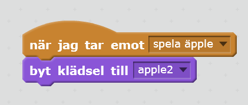

19. Efter att äpplet har spelat tonen så ska munnen stängas igen. Dra ut ett block från KONTROLL: **vänta _ sekunder** och ändra värdet till 0.2 sekunder.

20. Dra ut ett till block för UTSEENDE: **byt klädsel till...**. Välj klädseln **"apple"** så att äpplet får stängd mun igen.  

  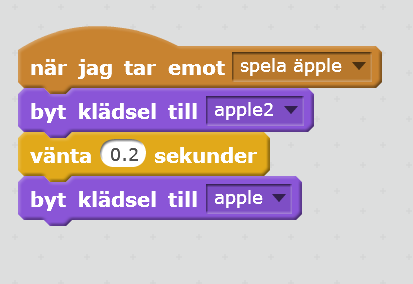

> Testa ditt projekt! Klicka på START. Vad händer nu när du trycker på tangenten "a"? Ändras klädseln så att det ser ut som att äpplet sjunger? Spelas tonen?

## Delmoment 5: Kopiera äpplet för fler toner

Men vi har ju bara en ton som spelas nu. Lite för tråkig synth! Nu ska du kopiera sprajten fem gånger och ändra i skripten för att få fem toner till. 

21. Klicka på kopiera-stämpeln i den grå bannern och klicka sedan på äpplet i rutan för Sprajtar. Då skapas en kopia av sprajten. 

  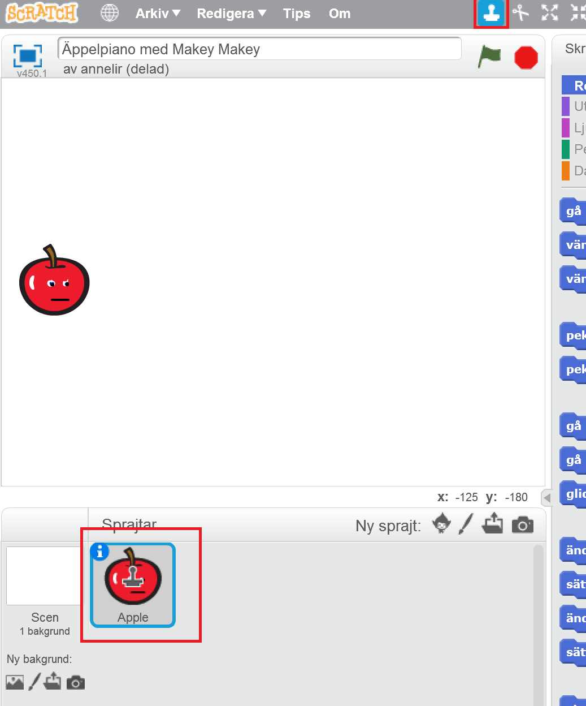

22. Kopiera sprajten flera gånger så att du har totalt sex äppel-sprajtar. Alla skript som du har skapat åt det första äpplet har också kopierats till de nya sprajtarna.
 
  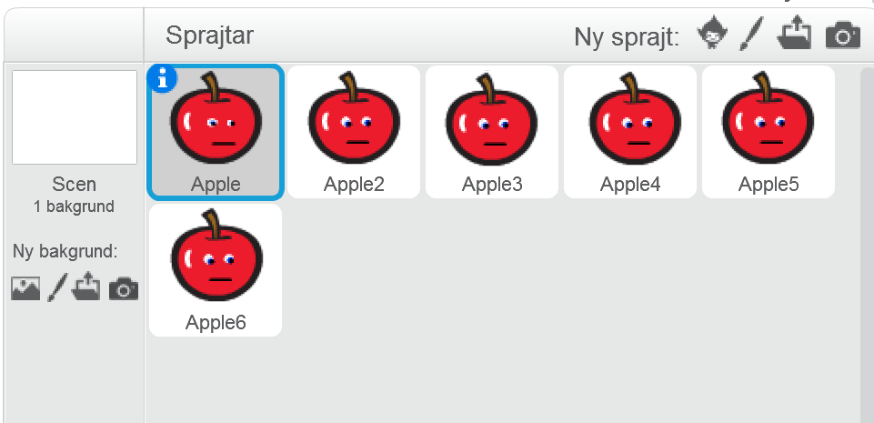 

23.	Klicka på sprajten **Apple2**. Nu behöver du ändra vilken ton äpplet ska spela och vilken tangent du ska trycka på! Byt ut koden i skriptet för Apple2 så att ton **67** spelas.

  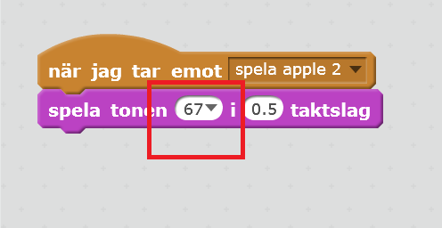

24.	Markera SCEN och ändra i skriptet så att meddelandet skickas när tangent **"g"** trycks ned. 

25.	Ett nytt meddelande måste skickas så att rätt sprajt spelar rätt ton. Välj **"nytt meddelande"** i rullistan och döp det nya meddelandet till **"spela äpple 2"**. 

  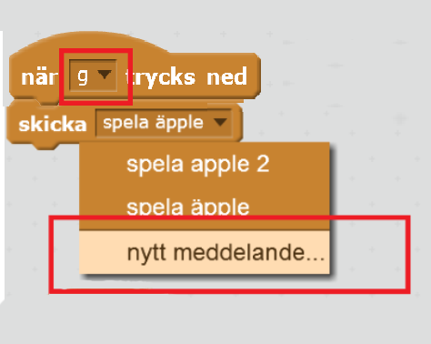

26.	Gå tillbaka till skripten för sprajten **Apple2** och ändra till **när jag tar emot "spela äpple 2"** för båda skript. 

  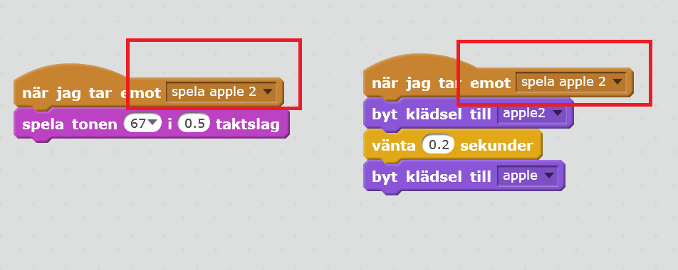

> Testa ditt projekt! Klicka på START. Prova nu att trycka på a eller g! Vad händer? Spelas två olika toner?

Nu ska vi göra likadant för resten av äpplena! 

27. Byt ut skripten för alla nya sprajtar. Glöm inte att skapa ett nytt meddelande för att skicka och ta emot, döp dem till **"spela äpple 3"** och så vidare fram till **spela äpple 6"**.

* Apple3 ska ha ton **69** och tangent **h**.
* Apple4 ska ha ton **65** och tangent **f**. 
* Apple5 ska ha ton **64** och tangent **d**.
* Apple6 ska ha ton **62** och tangent **s**. 

> Testa ditt projekt! Klicka på START. När du är klar med alla tangenter på din fantasisynth, prova att spela följande tangenter i rad: 
 **A A G G H H G F F D D S S A**.
Hör du vilken melodi du spelar? Nu kan du spela blinka lilla stjärna på din synth!  

## Färdig!
Grattis, nu har du gjort klart uppgiften.

**Glöm inte att spara ditt projekt!** Döp det gärna till uppgiftens namn så att du enkelt kan hitta den igen.

> **Testa ditt projekt**  
Visa gärna någon det som du har gjort och låt dem testa. Tryck på DELA för att andra ska kunna hitta spelet på Scratch. Gå ut till projektsidan och låt någon annan testa spelet!

## Frågeställningar

* Vad är ett meddelande?
* Vad kan du använda ett meddelande till?
* Varför kan en sprajt ha flera klädslar?
* Vad kan du använda det till?
* Hur kan du använda toner i Scratch?
* Vad händer när du ändrar taktslag för tonen?

## Tips
Om du har tillgång till **Makey Makey** kan du koppla din fantasisynth till den och spela musik på riktiga äpplen!
Makey Makey är ett litet kretskort för att styra datorn med saker som är elektriskt ledande, som till exempel frukt eller metall.

Här hittar du instruktion till att koppla in Makey Makey till din fantasisynth. 
