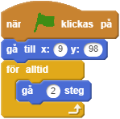
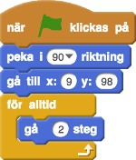
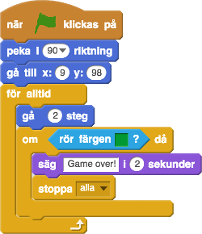

# Bug race

Nu ska du få bygga ett spel i Scratch där du kör runt en skalbagge på en bana.

### Scratch studio

Först lär vi oss de olika delarna i Scratch:

- Ett skript är flera kommandon i följd
- I Scratch ser kommandon ut som block
- Blocken ska sitta ihop (som ett pussel)
- Datorn läser blocken uppifrån och ned

### Exempel

Datorn läser detta som att den först ska gå 10 steg, sen vänta 1 sekund och sist gå 5 steg till.

**Gå vidare till nästa steg för att börja programmera.**

## 1: Börja programmera

Vi startar med att gå till Scratch-uppgiften i en webbläsare: 

**<a href="http://bit.ly/bugrace-vf" target="_blank">bit.ly/bugrace-vf</a>**

Vi har redan ritat ut en bana och lagt ut en skalbagge som du skall styra. Även alla block som behövs ligger framme.

> Om du undrar _hur_ eller _varför_ det fungerar eller om du har andra frågor kan du prata med någon av volontärerna.

**Nu programmerar vi!**

1. För att få skalbaggen att gå framåt behöver vi använda blocket <i class="sb">gå 2 steg</i> och sätta den efter blocket <i class="sb">när  klickas på</i>.

    

> Tryck på flaggan och se hur skalbaggen rör sig framåt varje gång du trycker.

Nu ska vi få skalbaggen att gå 2 steg hela tiden - för alltid. 

2. Vi får flytta <i class="sb">gå 2 steg</i> till blocket <i class="sb">för alltid</i> och stoppa in det där. 
3. Sen drar vi <i class="sb">för alltid > gå 2 steg</i> till start-blocket <i class="sb">när klickas på</i>.

    

> Tryck på flaggan och se hur den går ända till kanten.

När vi startar spelet igen så börjar inte skalbaggen om från början där vi vill att den ska. Vi måste säga till programmet att skalbaggen ska gå till en viss position när den gröna flaggan klickas på. 

4. Lägg blocket <i class="sb">gå till x:9 y:98</i> mellan <i class="sb">när klickas på</i> och <i class="sb">för alltid</i>.

    

> Tryck på flaggan några gånger och se hur skalbaggen alltid börjar på samma position.

Nu ska vi få skalbaggen att vända när vi trycker på piltangenterna.

5. När högerpil trycks ned vill vi att skalbaggen ska vända åt höger så vi drar blocket <i class="sb">vänd höger 15 grader</i> till blocket <i class="sb">när högerpil trycks ned</i>.

    

> Starta spelet och tryck på högerpilen på tangentbordet flera gånger. Skalbaggen svänger åt höger!

6. Gör samma sak med <i class="sb">när vänsterpil trycks ned</i> och <i class="sb">vänd vänster 15 grader</i>.

    

> Tryck på flaggan och använd höger och vänster piltangenter för att styra skalbaggen.

När du startar spelet nu efter några gånger märker du att skalbaggen pekar åt olika håll nästan varje gång. Vi vill att skalbaggen ska peka framåt varje gång vi startar. 

7. Lägg blocket <i class="sb">peka i 90 vinkel</i> mellan <i class="sb">när klickas på</i> och <i class="sb">gå till x:9 y:98</i>.

    

> Tryck på flaggan och se hur skalbaggen alltid pekar framåt när du startar.

Det går nu att köra runt på banan, men inget händer när vi kör utanför banan. Om vi åker utanför banan ska spelet säga _Game over!_ och avsluta spelet. Skriptet behöver kolla varje gång skalbaggen går 2 steg om vi rör färgen grön (samma som gräset) och då säga _Game over!_ samt stoppa spelet (stoppa alla skript).

8. Sätt in blocket <i class="sb">rör färgen ?</i> på den tomma rutan av <i class="sb">om <> då</i>-blocket.  
9. Dra även in <i class="sb">säg Game over! i 2 sekunder</i> in i <i class="sb">om <> då</i> och sen även <i class="sb">stoppa alla</i>.  
10. Slutligen flyttar vi hela <i class="sb">om <> då</i>-blocket och lägger det efter <i class="sb">gå 2 steg</i>.

    

> Tryck på flaggan och se vad som händer om du kör utanför banan.

Nu är vi nästan klara. Vi behöver bara säga till spelet att vi vunnit när vi kommit i mål (det gula strecket).

Precis som vi kollade i förra steget om vi rörde den gröna färgen vill vi nu kolla om vi rör den gula färgen istället. Om vi rör den gula färgen vill vi säga _Jag vann!_ och sen stoppa spelet.

11. Se om du kan klura ut hur du ska göra för att det ska fungera som vi vill. När du är klar kan du testa att trycka på flaggan och se om det fungerar. 

> Hur hela skriptet ser ut kan du se på nästa sida, men _försök gärna själv först_.

## 2: Ett färdigt spel

Så här ser hela skriptet ut när det är färdigt. Det behöver inte vara exakt likadant på alla ställen så länge det fungerar som du vill.

**Bra jobbat!**

## 3: Fortsättning

Du kan fortsätta programmera hemma eller i skolan. Du kan till exempel lägga till lite hinder på banan och du kan göra att två spelare kör varsin skalbagge samtidigt. Det finns mer att göra och fler uppgifter hittar du på kodboken.se.

<h2 id="dummy"></h2>
